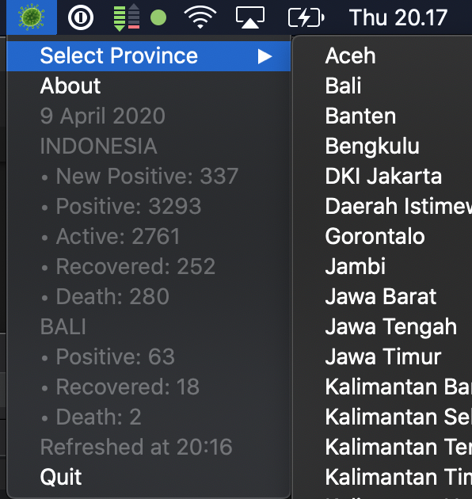

# 🦠 Covid19IDBar
  

*Get information about current cases of [coronavirus](https://en.wikipedia.org/wiki/2019%E2%80%9320_coronavirus_pandemic) right from the menu bar. Just in case you want to add anxiety to your life.*

## What?

A simple app that sits on your menu bar, that allows you to get informed on the cases of coronavirus in Indonesia, breakdown per province. It also updates every 30 mins. 

  

## How to download?

**[➡️ DOWNLOAD HERE](https://github.com/energetictree/covid19idbar/releases/latest/download/Covid19IDBar.zip)**

*Note: Mac Only*
*⚠️ Mac users, remember to [right click, or ctrl+click](https://support.apple.com/en-us/HT207700) after unzipping and hitting "open". If you are having problems see [this link](https://support.apple.com/en-us/HT202491). ⚠️*

## Where does the data come from? 

Country API from [my repo](https://github.com/energetictree/covid19idn/) 
Information comes originally from [BNPB](https://bnpb-inacovid19.hub.arcgis.com/datasets/statistik-perkembangan-covid19-indonesia). 

<<<<<<< HEAD
Province API from [my repo](https://github.com/javieraviles/covidAPI) 
=======
Province API from [my repo](https://github.com/energetictree/covid19id) 
>>>>>>> 768c86fc6612262972449c9c9dd615552c24d90b
Information comes originally from [BNPB](https://bnpb-inacovid19.hub.arcgis.com/datasets/covid19-indonesia-per-provinsi/data).

## How?
Python 3 and [rumps](https://rumps.readthedocs.io/en/latest/index.html).

❤️🐍

## Why? 

Why not? 🤷

## Thanks to? 

[This repo](https://github.com/duarteocarmo/coronabar/) for the original app

## How To Compile?

python3 setup.py py2app --packages=pkg_resources
